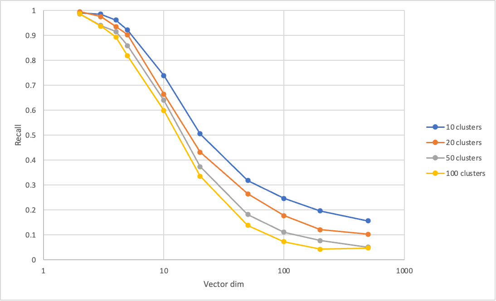

# ANN Recall vs Dimensionality
This repo demonstrates diminishing effectiveness of cluster-based approximate vector search, e.g., Faiss-IVF with increasing dimension.

## Usage
```
usage: main.py [-h] [--dims DIMS] [--clusters CLUSTERS] [--ndb NDB] [--nq NQ] [--num_train NUM_TRAIN] [--normalize]

options:
  -h, --help            show this help message and exit
  --dims DIMS           comma-separated dims
  --clusters CLUSTERS   comma-separated # clusters
  --ndb NDB             # database
  --nq NQ               # queries
  --num_train NUM_TRAIN
                        # data used for clustering
  --normalize           normalize db vectors
  ```

  ## Result
